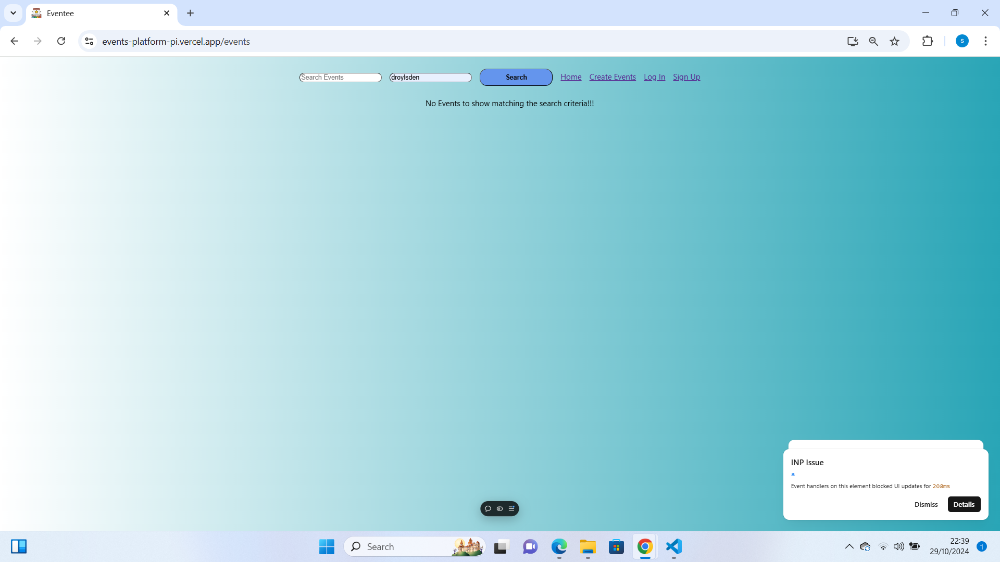

# EVENTS PLATFORM

This website project is typically used by business, organizations, or individuals who want to promote and manage their events within a community.In this Project, I have developed an responsive UI and accessible webpages for the user to sign up, sign in, create events, view events and adding events to user calendar. Also I have created a new backend Api [eventsAPI](https://github.com/SuganyaArul/events_API) to fetch/retrieve the relevant data based on the webpage load. 

The website is now deployed in live, available on Vercel hosted at https://events-platform-pi.vercel.app/

# HOW TO USE
Below are few sample user logon details which I have used for testing the scope of MVP features, please consider the below for your testing and as well create own user accounts 

# Test user Accounts:

username:benmitchell963@gmail.com
password:benmi@963

username:sarahmachin04@yahoo.com
password:Sara@y04

# Events platform Website Features: 

# 1. Home Page:
A. Search Events: User can search events by location and title, by default if user clicks on search button all the events will be loaded. Based on the search criteria the corresponding event cards will be displayed.


B. Appropriate validations have been handled for if user tries to search using incorrect values for "Search Events" and "Location" 



C. View Event Details: Clicking an event card displays detailed information about the event and allows user to reserve a spot for the event.

# 1.1 Sign Up feature for New User 

A. Sign up webpage created for the user gathering key details related to login and allows user to proceed further. Validations for UserName, Full Name & Email field have been handled appropriately. 


B. Upon successful sign up of the user account, successful acknowledgement being shown to the user and user can now able to Browse, manage events and ability to log out from the website. Also at this stage the user provided with the option to Create own events and publish it for community


# 1.2 Log in feature for Existing Users

A. Log in webpage created for the existing users to logon into the website so that they can able to create new events for the community and allows user to Browse, manage events and log out from the website.


# 2.Create Events

A. Once the user logged on successfully and when "Create Events" link is accessed then the web page loaded to capture the key details of the event such as Event Title, Description, Date, location etc


B. Upon successful new events creation, the newly added event is now displayed under the search within the home page of the user account.


# 3.Add Events to user calendar:
Please note:- For testing I have used user's Yahoo and Gmail accounts to add the respect event into the user calendar, the feature can be extended to other email account types 
   - Once the user successfully signed up and able to look into the event , feasibility is now provided for the user to reserve the event into their calendar. when user clicks on "Reserve a spot" then the event will be added into the user calendar straightaway (see below the event is now added into gmail account calendar)

   
   

   If the user signed up via "Yahoo" account and user clicks on "Reserve a spot" then the event will be added into the user's Yahoo calendar straightaway 

   
   

   - For the new user who haven't signed up into the Event website but they have to reserve a spot from the events card displayed then the website allows the user to reserve a spot by filling the details (first name, last name and email address). This feature introduced as a new form because few users will reserve events without signing into the website/app.

   
   
   
   
   


# INSTRUCTIONS TO SETUP

The code for this project will available in [this GitHub Repo](https://github.com/SuganyaArul/Events_Platform)

1.To clone using the git command

```
git clone https://github.com/SuganyaArul/Events_Platform
```
2.cd into the root Events_Platform

3.To install npm package

```
npm install
```
4.To install axios package

```
npm install axios
```
5.To install react router package

```
npm i react-router-dom
```
6.Create new .env file to set CLIENT_ID and API_KEY

REACT_APP_CLIENT_ID=
REACT_APP_API_KEY=

7.To view in browser, give the below command in Terminal

```
npm start
```


